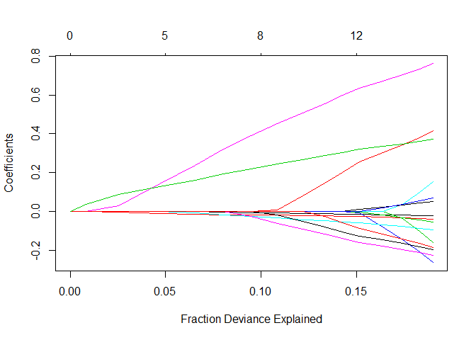
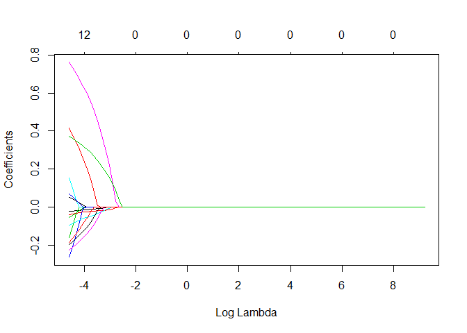
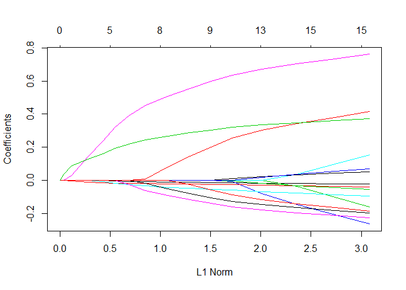
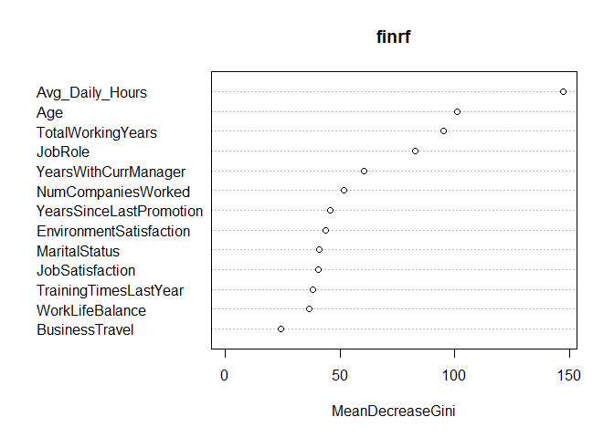

CombinedMarkdown
================

## R Markdown

``` r
library(dplyr)
```

    ## 
    ## Attaching package: 'dplyr'

    ## The following objects are masked from 'package:stats':
    ## 
    ##     filter, lag

    ## The following objects are masked from 'package:base':
    ## 
    ##     intersect, setdiff, setequal, union

``` r
library(tidyr)
library(ggplot2)
library(Amelia)
```

    ## Loading required package: Rcpp

    ## ## 
    ## ## Amelia II: Multiple Imputation
    ## ## (Version 1.7.5, built: 2018-05-07)
    ## ## Copyright (C) 2005-2019 James Honaker, Gary King and Matthew Blackwell
    ## ## Refer to http://gking.harvard.edu/amelia/ for more information
    ## ##

``` r
#read in merged data, created by conmbining several spreadsheets
Master_Data <- read.csv("master.csv")
```

``` r
##CLEAN DATA

#Omit NA data from dataframe since very little NA
Master_Data <- na.omit(Master_Data)

#Remove columns we dont need in our analysis
Master_Data$StandardHours <- NULL
Master_Data$Over18 <- NULL
Master_Data$EmployeeCount <- NULL
Master_Data$EmployeeID <- NULL
```

``` r
##SPLIT DATA
library(caTools)
set.seed(1)
sample <- sample.split(Master_Data$Attrition,SplitRatio = 0.7)

#Training Data
train <- subset(Master_Data,sample==T)
#Testing Data
test <- subset(Master_Data,sample==F)
```

``` r
##TRAIN THE LOGISTIC REGRESSION MODEL
logModel <- glm(Attrition ~., family = binomial('logit'),data = train)
summary(logModel)
```

    ## 
    ## Call:
    ## glm(formula = Attrition ~ ., family = binomial("logit"), data = train)
    ## 
    ## Deviance Residuals: 
    ##     Min       1Q   Median       3Q      Max  
    ## -1.8609  -0.5653  -0.3310  -0.1488   3.7148  
    ## 
    ## Coefficients:
    ##                                    Estimate Std. Error z value Pr(>|z|)
    ## (Intercept)                       6.481e-01  1.129e+00   0.574  0.56600
    ## Age                              -3.679e-02  9.059e-03  -4.062 4.88e-05
    ## BusinessTravelTravel_Frequently   1.394e+00  2.616e-01   5.330 9.81e-08
    ## BusinessTravelTravel_Rarely       6.916e-01  2.423e-01   2.855  0.00431
    ## DepartmentResearch & Development -8.725e-01  3.283e-01  -2.658  0.00787
    ## DepartmentSales                  -9.884e-01  3.456e-01  -2.860  0.00423
    ## DistanceFromHome                  2.989e-03  7.174e-03   0.417  0.67693
    ## Education                        -6.062e-02  5.649e-02  -1.073  0.28322
    ## EducationFieldLife Sciences      -5.450e-01  4.657e-01  -1.170  0.24183
    ## EducationFieldMarketing          -6.553e-01  5.107e-01  -1.283  0.19945
    ## EducationFieldMedical            -6.252e-01  4.648e-01  -1.345  0.17862
    ## EducationFieldOther              -6.641e-01  5.216e-01  -1.273  0.20289
    ## EducationFieldTechnical Degree   -6.937e-01  4.938e-01  -1.405  0.16004
    ## GenderMale                        1.805e-01  1.194e-01   1.511  0.13072
    ## JobLevel                         -4.245e-02  5.227e-02  -0.812  0.41679
    ## JobRoleHuman Resources           -1.267e-01  3.648e-01  -0.347  0.72840
    ## JobRoleLaboratory Technician      1.766e-01  2.331e-01   0.758  0.44863
    ## JobRoleManager                   -5.539e-01  3.263e-01  -1.698  0.08959
    ## JobRoleManufacturing Director    -6.370e-01  2.842e-01  -2.241  0.02503
    ## JobRoleResearch Director          6.957e-01  3.017e-01   2.306  0.02111
    ## JobRoleResearch Scientist         8.511e-02  2.297e-01   0.370  0.71104
    ## JobRoleSales Executive            2.260e-01  2.271e-01   0.995  0.31977
    ## JobRoleSales Representative       2.934e-02  2.966e-01   0.099  0.92122
    ## MaritalStatusMarried              1.788e-01  1.705e-01   1.049  0.29425
    ## MaritalStatusSingle               1.134e+00  1.705e-01   6.653 2.87e-11
    ## MonthlyIncome                    -2.037e-07  1.254e-06  -0.162  0.87093
    ## NumCompaniesWorked                1.469e-01  2.517e-02   5.837 5.32e-09
    ## PercentSalaryHike                 1.038e-02  2.475e-02   0.419  0.67511
    ## StockOptionLevel                 -8.801e-03  6.801e-02  -0.129  0.89703
    ## TotalWorkingYears                -9.679e-02  1.701e-02  -5.690 1.27e-08
    ## TrainingTimesLastYear            -1.333e-01  4.584e-02  -2.909  0.00362
    ## YearsAtCompany                    5.881e-02  2.427e-02   2.423  0.01539
    ## YearsSinceLastPromotion           1.771e-01  2.660e-02   6.659 2.77e-11
    ## YearsWithCurrManager             -2.019e-01  3.011e-02  -6.704 2.02e-11
    ## EnvironmentSatisfaction          -3.671e-01  5.208e-02  -7.049 1.81e-12
    ## JobSatisfaction                  -3.349e-01  5.266e-02  -6.360 2.02e-10
    ## WorkLifeBalance                  -3.912e-01  7.784e-02  -5.026 5.01e-07
    ## JobInvolvement                   -6.500e-02  7.963e-02  -0.816  0.41437
    ## PerformanceRating                -4.743e-02  2.470e-01  -0.192  0.84776
    ## Avg_Daily_Hours                   1.995e+00  1.532e+00   1.302  0.19279
    ## Avg_Weekly_Hours                 -3.340e-01  3.358e-01  -0.995  0.31995
    ## Days_off                         -4.706e-02  5.307e-02  -0.887  0.37523
    ##                                     
    ## (Intercept)                         
    ## Age                              ***
    ## BusinessTravelTravel_Frequently  ***
    ## BusinessTravelTravel_Rarely      ** 
    ## DepartmentResearch & Development ** 
    ## DepartmentSales                  ** 
    ## DistanceFromHome                    
    ## Education                           
    ## EducationFieldLife Sciences         
    ## EducationFieldMarketing             
    ## EducationFieldMedical               
    ## EducationFieldOther                 
    ## EducationFieldTechnical Degree      
    ## GenderMale                          
    ## JobLevel                            
    ## JobRoleHuman Resources              
    ## JobRoleLaboratory Technician        
    ## JobRoleManager                   .  
    ## JobRoleManufacturing Director    *  
    ## JobRoleResearch Director         *  
    ## JobRoleResearch Scientist           
    ## JobRoleSales Executive              
    ## JobRoleSales Representative         
    ## MaritalStatusMarried                
    ## MaritalStatusSingle              ***
    ## MonthlyIncome                       
    ## NumCompaniesWorked               ***
    ## PercentSalaryHike                   
    ## StockOptionLevel                    
    ## TotalWorkingYears                ***
    ## TrainingTimesLastYear            ** 
    ## YearsAtCompany                   *  
    ## YearsSinceLastPromotion          ***
    ## YearsWithCurrManager             ***
    ## EnvironmentSatisfaction          ***
    ## JobSatisfaction                  ***
    ## WorkLifeBalance                  ***
    ## JobInvolvement                      
    ## PerformanceRating                   
    ## Avg_Daily_Hours                     
    ## Avg_Weekly_Hours                    
    ## Days_off                            
    ## ---
    ## Signif. codes:  0 '***' 0.001 '**' 0.01 '*' 0.05 '.' 0.1 ' ' 1
    ## 
    ## (Dispersion parameter for binomial family taken to be 1)
    ## 
    ##     Null deviance: 2661.4  on 3009  degrees of freedom
    ## Residual deviance: 2034.4  on 2968  degrees of freedom
    ## AIC: 2118.4
    ## 
    ## Number of Fisher Scoring iterations: 6

``` r
##PREDICTIONS
pred_probabilities <- predict(logModel,test,type = 'response')
pred_results <- ifelse(pred_probabilities>0.5,1,0)

#Convert Attrition column in test to 0s and 1s to compare to pred_results
test$AttritionClass <- ifelse(test$Attrition == 'Yes',1,0)

misClassError <- mean(pred_results != test$AttritionClass)
accuracy <- (1-misClassError)

cat("Misclassification error:", misClassError, "\n")
```

    ## Misclassification error: 0.1457364

``` r
cat("Accuracy:", accuracy, "\n")
```

    ## Accuracy: 0.8542636

``` r
#error types
match <- data.frame(cbind(pred_results, actual = test$AttritionClass))

match$error[(match$pred_results == 1 & match$actual ==1)] <- 'True positive'
match$error[(match$pred_results == 0 & match$actual ==1)] <- 'False negative'
match$error[(match$pred_results == 0 & match$actual ==0)] <- 'True negative'
match$error[(match$pred_results == 1 & match$actual ==0)] <- 'False positive'

errorType <- as.data.frame(addmargins(table(match$error)))

print(errorType)
```

    ##             Var1 Freq
    ## 1 False negative  150
    ## 2 False positive   38
    ## 3  True negative 1043
    ## 4  True positive   59
    ## 5            Sum 1290

``` r
cat("Probability that an employee predicted to stay leaves:", errorType[1, 2]/(errorType[1, 2] + errorType[3, 2]))
```

    ## Probability that an employee predicted to stay leaves: 0.1257334

``` r
cat("\nProbability that an employee predicted to leave stays:", errorType[2, 2]/(errorType[2, 2] + errorType[4, 2]))
```

    ## 
    ## Probability that an employee predicted to leave stays: 0.3917526

``` r
#LASSO to determine variables to include
library(glmnet)
```

    ## Loading required package: Matrix

    ## 
    ## Attaching package: 'Matrix'

    ## The following object is masked from 'package:tidyr':
    ## 
    ##     expand

    ## Loading required package: foreach

    ## Loaded glmnet 2.0-18

``` r
trainMatrix <- model.matrix(Attrition ~ ., data = train)
testMatrix <- model.matrix(Attrition ~ ., data = test)
grid <- 10 ^ seq(4, -2, length = 100)
lasso <- glmnet(trainMatrix, train$Attrition, alpha = 1, lambda = grid, thresh = 1e-12, family = "binomial")
lassoCV <- cv.glmnet(trainMatrix, train$Attrition, alpha = 1, lambda = grid, thresh = 1e-12, family = "binomial")
lassoLambdaMin <- lassoCV$lambda.min
predict(lasso, s = lassoLambdaMin, type = "coefficients")
```

    ## 43 x 1 sparse Matrix of class "dgCMatrix"
    ##                                            1
    ## (Intercept)                      -1.78129932
    ## (Intercept)                       .         
    ## Age                              -0.02386590
    ## BusinessTravelTravel_Frequently   0.41497048
    ## BusinessTravelTravel_Rarely       .         
    ## DepartmentResearch & Development  .         
    ## DepartmentSales                   .         
    ## DistanceFromHome                  .         
    ## Education                         .         
    ## EducationFieldLife Sciences       .         
    ## EducationFieldMarketing           .         
    ## EducationFieldMedical             .         
    ## EducationFieldOther               .         
    ## EducationFieldTechnical Degree    .         
    ## GenderMale                        .         
    ## JobLevel                          .         
    ## JobRoleHuman Resources            .         
    ## JobRoleLaboratory Technician      .         
    ## JobRoleManager                   -0.16098795
    ## JobRoleManufacturing Director    -0.26519747
    ## JobRoleResearch Director          0.15305345
    ## JobRoleResearch Scientist         .         
    ## JobRoleSales Executive            .         
    ## JobRoleSales Representative       .         
    ## MaritalStatusMarried              .         
    ## MaritalStatusSingle               0.76126536
    ## MonthlyIncome                     .         
    ## NumCompaniesWorked                0.05067720
    ## PercentSalaryHike                 .         
    ## StockOptionLevel                  .         
    ## TotalWorkingYears                -0.04246282
    ## TrainingTimesLastYear            -0.05622341
    ## YearsAtCompany                    .         
    ## YearsSinceLastPromotion           0.06909769
    ## YearsWithCurrManager             -0.09518904
    ## EnvironmentSatisfaction          -0.22869074
    ## JobSatisfaction                  -0.19877276
    ## WorkLifeBalance                  -0.18575042
    ## JobInvolvement                    .         
    ## PerformanceRating                 .         
    ## Avg_Daily_Hours                   0.37250976
    ## Avg_Weekly_Hours                  .         
    ## Days_off                          .

``` r
testMatrix = testMatrix[,-43]
```

``` r
pred_probabilitiesLASSO <- predict(lasso, s = lassoLambdaMin, type = "response", newx = testMatrix)
pred_resultsLASSO <- ifelse(pred_probabilitiesLASSO>0.5,1,0)

#Convert Attrition column in test to 0s and 1s to compare to pred_results
#test$AttritionClass <- ifelse(test$Attrition == 'Yes',1,0)

misClassErrorLASSO <- mean(pred_resultsLASSO != test$AttritionClass)
accuracyLASSO <- (1-misClassErrorLASSO)

cat("Misclassification error:", misClassErrorLASSO, "\n")
```

    ## Misclassification error: 0.1457364

``` r
cat("Accuracy:", accuracyLASSO, "\n")
```

    ## Accuracy: 0.8542636

``` r
#error types
matchLASSO <- data.frame(cbind(pred_resultsLASSO, actual = test$AttritionClass))
names(matchLASSO) <- c("pred_resultsLASSO", "actual")

matchLASSO$error[(matchLASSO$pred_resultsLASSO == 1 & matchLASSO$actual ==1)] <- 'True positive'
matchLASSO$error[(matchLASSO$pred_resultsLASSO == 0 & matchLASSO$actual ==1)] <- 'False negative'
matchLASSO$error[(matchLASSO$pred_resultsLASSO == 0 & matchLASSO$actual ==0)] <- 'True negative'
matchLASSO$error[(matchLASSO$pred_resultsLASSO == 1 & matchLASSO$actual ==0)] <- 'False positive'

errorTypeLASSO <- as.data.frame(addmargins(table(matchLASSO$error)))

print(errorTypeLASSO)
```

    ##             Var1 Freq
    ## 1 False negative  182
    ## 2 False positive    6
    ## 3  True negative 1075
    ## 4  True positive   27
    ## 5            Sum 1290

``` r
cat("Probability that an employee predicted to stay leaves:", errorTypeLASSO[1, 2]/(errorTypeLASSO[1, 2] + errorTypeLASSO[3, 2]))
```

    ## Probability that an employee predicted to stay leaves: 0.1447892

``` r
cat("\nProbability that an employee predicted to leave stays:", errorTypeLASSO[2, 2]/(errorTypeLASSO[2, 2] + errorTypeLASSO[4, 2]))
```

    ## 
    ## Probability that an employee predicted to leave stays: 0.1818182

``` r
plot(lasso, xvar = "dev")
```

    ## Warning in regularize.values(x, y, ties, missing(ties)): collapsing to
    ## unique 'x' values

<!-- -->

``` r
plot(lasso, xvar = "lambda")
```

<!-- -->

``` r
plot(lasso, xvar = "norm")
```

    ## Warning in regularize.values(x, y, ties, missing(ties)): collapsing to
    ## unique 'x' values

<!-- -->

``` r
compareLogLASSO <- data.frame(cbind(match$error, matchLASSO$error))
names(compareLogLASSO) <- c('Logistic', 'Lasso')
source("http://pcwww.liv.ac.uk/~william/R/crosstab.r")

crosstab(compareLogLASSO, row.vars = "Logistic", col.vars = "Lasso", type = "f", addmargins=TRUE)
```

    ##                Lasso False negative False positive True negative True positive  Sum
    ## Logistic                                                                           
    ## False negative                  149              0             0             1  150
    ## False positive                    0              6            32             0   38
    ## True negative                     0              0          1043             0 1043
    ## True positive                    33              0             0            26   59
    ## Sum                             182              6          1075            27 1290

``` r
library(randomForest)
```

    ## randomForest 4.6-14

    ## Type rfNews() to see new features/changes/bug fixes.

    ## 
    ## Attaching package: 'randomForest'

    ## The following object is masked from 'package:ggplot2':
    ## 
    ##     margin

    ## The following object is masked from 'package:dplyr':
    ## 
    ##     combine

``` r
set.seed(1)
#Drop the variables whose coefficients = 0 in LASSO
#Produces a simpler model without compromising accuracy.
Master_Data <- Master_Data[,-c(4,5,6,7,8,9,12,14,15,18,24,25,27,28)]
sample <- sample.split(Master_Data$Attrition,SplitRatio = 0.7)

#Training Data
train <- subset(Master_Data,sample==T)
#Testing Data
test <- subset(Master_Data,sample==F)

set.seed(1)
finrf = randomForest(Attrition~.,data=train,ntree=500)
finrfpred=predict(finrf,newdata=test)


cat("Misclassification error:", sum(abs(as.numeric(test$Attrition)-as.numeric(finrfpred)))/nrow(test))
```

    ## Misclassification error: 0.02170543

``` r
finrfrmse = sqrt(sum((as.numeric(test$Attrition)-as.numeric(finrfpred))^2)/nrow(test))

varImpPlot(finrf)
```

<!-- -->

``` r
#error types for random forest
forestMatch <- data.frame(cbind(test$Attrition, finrfpred))
names(forestMatch) <- c('actual', 'prediction')

source("http://pcwww.liv.ac.uk/~william/R/crosstab.r")

crosstab(forestMatch, row.vars = "actual", col.vars = "prediction", type = "f", addmargins=TRUE)
```

    ##        prediction    1    2  Sum
    ## actual                          
    ## 1                 1075    6 1081
    ## 2                   22  187  209
    ## Sum               1097  193 1290

``` r
forestMatch$error[(forestMatch$prediction == 2 & forestMatch$actual ==2)] <- 'True positive'
forestMatch$error[(forestMatch$prediction == 1 & forestMatch$actual ==2)] <- 'False negative'
forestMatch$error[(forestMatch$prediction == 1 & forestMatch$actual ==1)] <- 'True negative'
forestMatch$error[(forestMatch$prediction == 2 & forestMatch$actual ==1)] <- 'False positive'

errorType <- as.data.frame(addmargins(table(forestMatch$error)))

print(errorType)
```

    ##             Var1 Freq
    ## 1 False negative   22
    ## 2 False positive    6
    ## 3  True negative 1075
    ## 4  True positive  187
    ## 5            Sum 1290

``` r
cat("Probability that an employee predicted to stay leaves:", errorType[1, 2]/(errorType[1, 2] + errorType[3, 2]))
```

    ## Probability that an employee predicted to stay leaves: 0.02005469

``` r
cat("\nProbability that an employee predicted to leave stays:", errorType[2, 2]/(errorType[2, 2] + errorType[4, 2]))
```

    ## 
    ## Probability that an employee predicted to leave stays: 0.03108808
